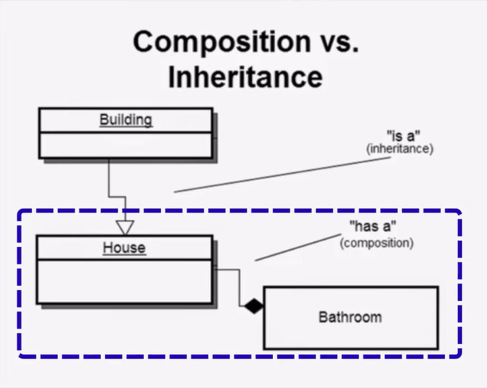

We do not have inheritance or any some of it  
We have Composition in Golang as a non-OOP Language instead of inheritance  
Composition is "Has a" type of OOP Definition 
 
 
In the best practice,  the programmer could implement the parent class only as a type in the child structs 
<h1>We call it Embedded Struct</h1>  
<h2>And this section is name Embedded types</h2>