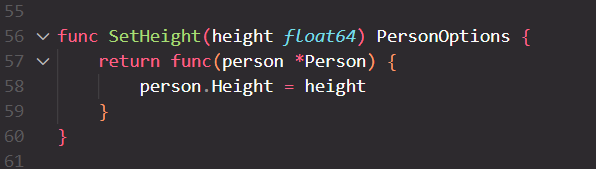

With Functional Options Pattern AKA FOP, we could implement setter functions separately  
<h3>The advantage of this pattern is that the program can check the value before committing to memory</h3>

like : If a person with a known Height is shorter than 155 can't be registered as a Rescuer 
  

But with the constructor pattern (Builder), we can implement the setter functions inside the constructor  