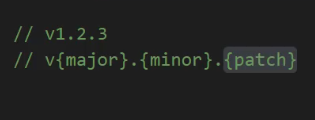

we initialize a module with this command below  

##go init moduleName 

 

##go get -u {package address & name}  

the way we download a module or getting it from some where  

##go get -u : it updates the modules on your project  

after update by the last command it'll update the module to last {minor} version 