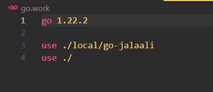
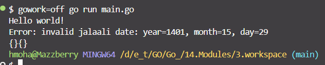

create work space

it'll create a file that named go.work  

In "go.work" we can specify a specific version of a module to use in development
 

while we using go workSpace, should describe our module too. see (line: 4)
 

<h3>SOME NOTES:</h3>  
1- better be using go.work in Development phase (send it to gitignore)

 

Do not use the workspace for this run of the file (it will not use the workspace temporarily) 

##this command only works in bash, not cmd or pws