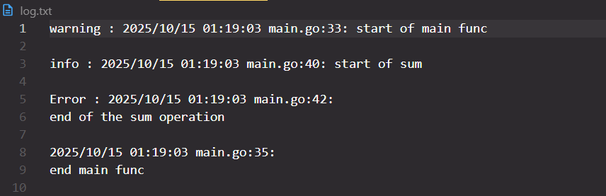

```Go
func init() {
	file, err := os.OpenFile("log.txt", os.O_CREATE | os.O_APPEND | os.O_WRONLY, 0666)
	if err != nil {
		log.Fatalln("something went wrong with log file", err)
	}
	log.SetOutput(file)
}
```
<br>
we've just set up a log file 
<br>

```Go
 	log.SetFlags(log.Ldate | log.Ltime | log.Lshortfile)
```
<br>
<p>with setFlag we could specify the needed information and get it in log file as log. like date, time or file name that log happened in to it </p>
<br>

##PREFIXING_IN_LOG
<br>

```Go
    var (  
	    errorLogger *log.Logger
	    warnLogger  *log.Logger
	    infoLogger  *log.Logger
    )
    //global variables
```
```Go
errorLogger = log.New(file, "Error : ", flags)
warnLogger = log.New(file, "warning : ", flags)
infoLogger = log.New(file, "info : ", flags)
 // and set these in init()
```
<br>

then we call the prefixes instead of 
```Go
log.Println()
```
like 
<br>

```Go
func main() {
	warnLogger.Println("start of main func\n")
	sum(2, 3)
	warnLogger.Println("\nend main func\n")

}
```
<br>
<p>and the result will be like this in log file</p>
<br>



<br>
